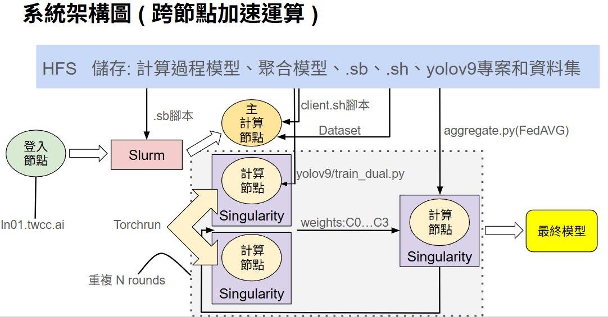
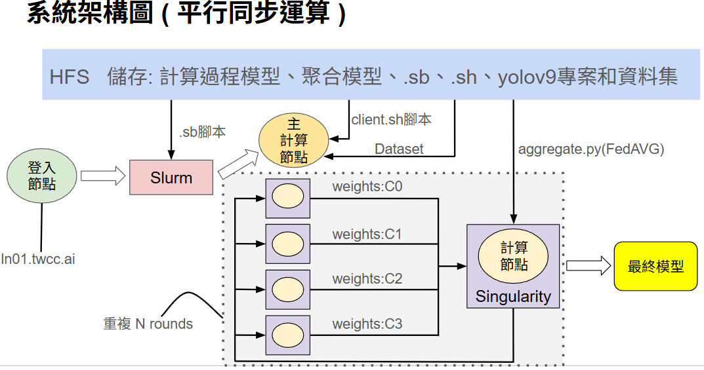

# Federated YOLOv9 on NCHC HPC

實作在 NCHC/TWCC HPC 上的 **聯邦式學習 (Federated Learning)** 版 YOLOv9：支援多節點多 GPU、Slurm 排程、Singularity 容器，以及集中式/聯邦式訓練與評估。

> Based on YOLOv9. Federated extensions and HPC scripts by QQ.

---

## 📦 環境說明  

本專案運行於 **國網中心 (NCHC) TWCC HPC** 叢集環境，使用 **Slurm** 作業排程系統與 **Singularity** 容器管理工具。  
- **Slurm**：負責跨節點、跨 GPU 的分配與調度。  
- **Singularity**：用於建立獨立、可攜帶的容器環境，確保實驗的可重現性。  
- 詳細 TWCC 使用方式，請參考官方文件 👉 [TWCC 使用手冊][https://man.twcc.ai](https://man.twcc.ai/@twccdocs/doc-twnia2-main-zh/https%3A%2F%2Fman.twcc.ai%2F%40twccdocs%2Ftwnia2-overview-zh)  

此環境支援 **多節點多 GPU** 的聯邦學習實驗，適合大規模分散式訓練。  

---

## 📂 資料集說明

### 下載 KITTI 資料集
本專案使用 **KITTI Vision Benchmark Suite - 2D Object Detection**  
官方網址：[KITTI Dataset](https://www.cvlibs.net/datasets/kitti/eval_object.php?obj_benchmark=2d)

請先下載 **images** 與 **labels**（YOLO 格式或經轉換後的標註檔）。

```bash
# 建立資料夾
cd datasets/kitti

# 下載 KITTI 官方影像與標註檔（需先到官網註冊並同意協議）
wget http://www.cvlibs.net/download.php?file=data_object_image_2.zip -O images.zip
wget http://www.cvlibs.net/download.php?file=data_object_label_2.zip -O labels.zip

# 解壓縮
unzip images.zip -d images
unzip labels.zip -d labels

```
## 🚀 執行方法（How to Run）

> 本專案在 **NCHC / TWCC HPC** 上運行，透過 **Slurm** 排程與 **Singularity**（或 Conda）環境執行。下列為兩種常見操作模式的**步驟說明**；對應指令已封裝於 `scripts/` 內的腳本中，請依你的資源（節點/GPU/partition）調整後提交。

---

### A) 多 GPU 跨節點加速運算（集中式 DDP 基準線）



**目的**：使用 `central`（client0–3 合併）資料集進行集中式訓練，作為與聯邦式訓練比較的 baseline。

**步驟**
1. **確認環境**：已於 TWCC 建好容器/環境（Singularity 或 Conda），可使用 GPU。
2. **資料設定**：`data/kitti_central.yaml` 指向 `datasets/kitti/central/`（影像/標註）。
3. **資源配置**：在 Slurm 腳本中設定節點數、每節點 GPU 數、CPU/記憶體等（參考 `scripts/` 中的集中式訓練腳本）。
4. **提交訓練**：以 DDP（多節點多 GPU）(fed_client.sb)方式啟動集中式訓練。
5. **查看結果**：訓練權重（baseline）輸出至 `fed_central_weights/`（或你的 runs 路徑）；使用驗證腳本在 `val` 上測試，輸出至 `fed_val_central/`。

---

### B) 平行同步運算（Federated Learning：Clients 並行 → Server 聚合）



**目的**：模擬真實分散式情境；clients 於各自資料上**並行訓練**，完畢後由 server **同步聚合**（FedAvg），反覆多輪直到收斂。

**步驟**
1. **建立/確認輸出目錄**：`fed_client_weights/`、`global_round_weights/`、`fed_final_weights/`、`fed_val_client/`（供各階段輸出）。
2. **Round 1：Clients 並行訓練**  
   - 為 client0–3 分別提交訓練作業（各自讀取 `data/kitti_client{i}.yaml`）。  
   - 完成後於 `fed_client_weights/round_1/` 產生各 client 的權重。
3. **Round 1：Server 聚合**  
   - 以聚合腳本執行 FedAvg，產生 `global_round_weights/round_1/` 的全域權重。
4. **廣播新權重**  
   - 將 Round 1 的全域權重下發至 client0–3 作為 Round 2 的初始化。
5. **Round 2 → N：重複 2–4**  
   - 直到達成設定的回合數或收斂條件。
6. **最終輸出**  
   - 於 `fed_final_weights/` 取得最終全域模型（例如 `best.pt`）。
7. **評估與可視化**  
   - 使用驗證腳本在 `val` 上評估全域與各 client 的模型；結果輸出到 `fed_val_client/`（與/或 `fed_val_central/`）。  
   - 可將指標（mAP、單輪耗時、每輪傳輸量等）匯出至 `figure/` 供簡報使用。

---

### 備註
- **環境**：TWCC 建議使用 **Singularity** 確保一致性；本地測試可改用 **Conda**。
- **路徑一致性**：確保 YAML 中的資料路徑與實際目錄一致（`central` / `client0~3` / `val`）。


  

